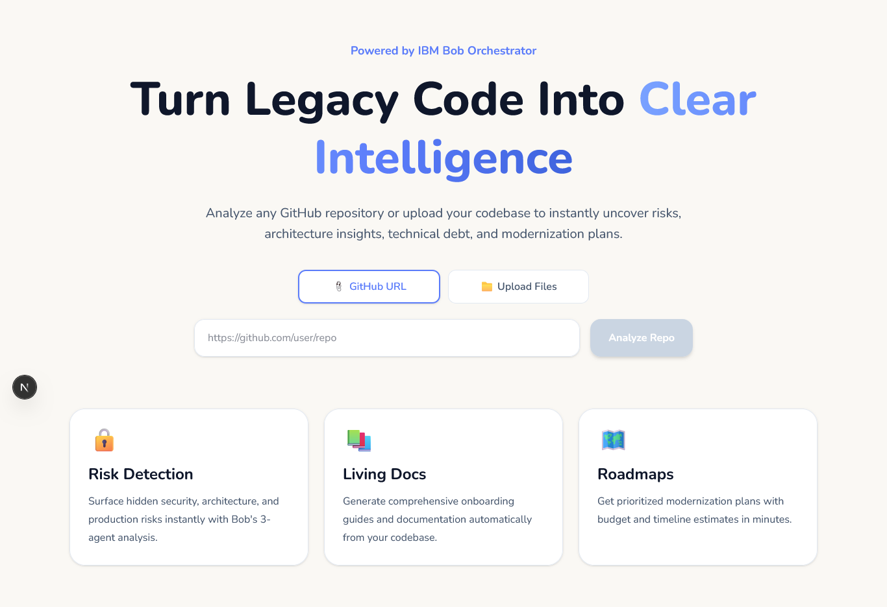
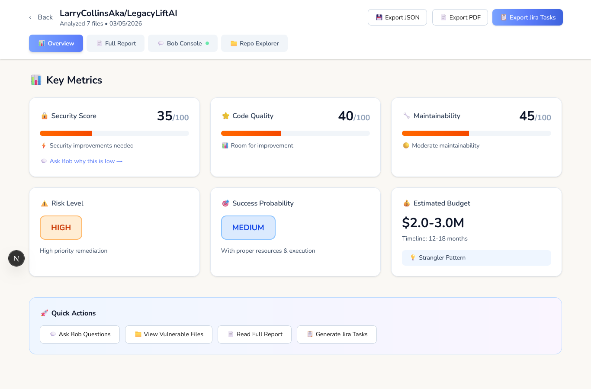
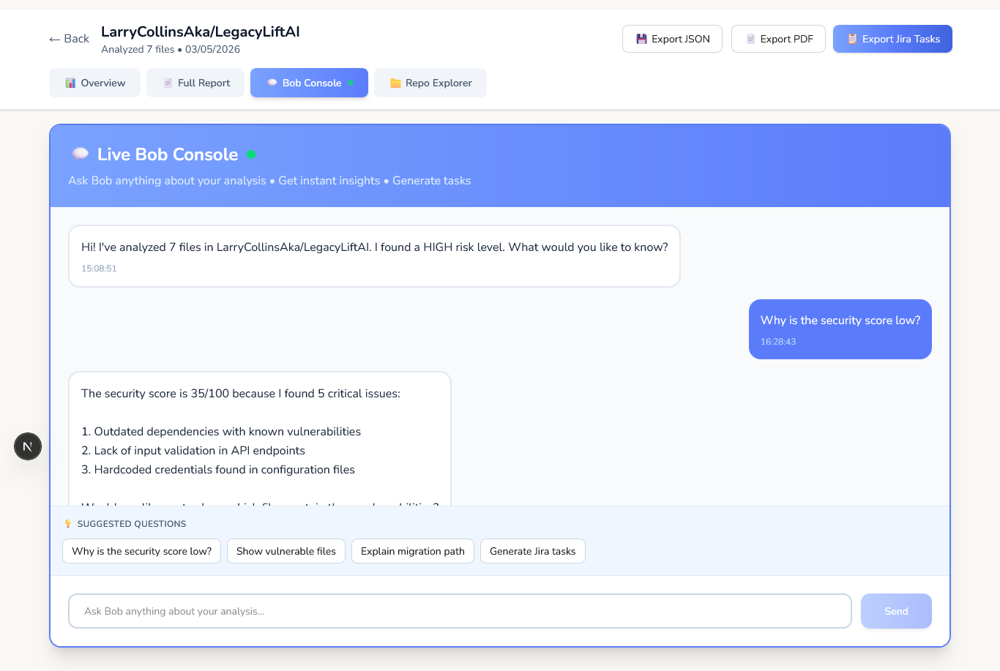
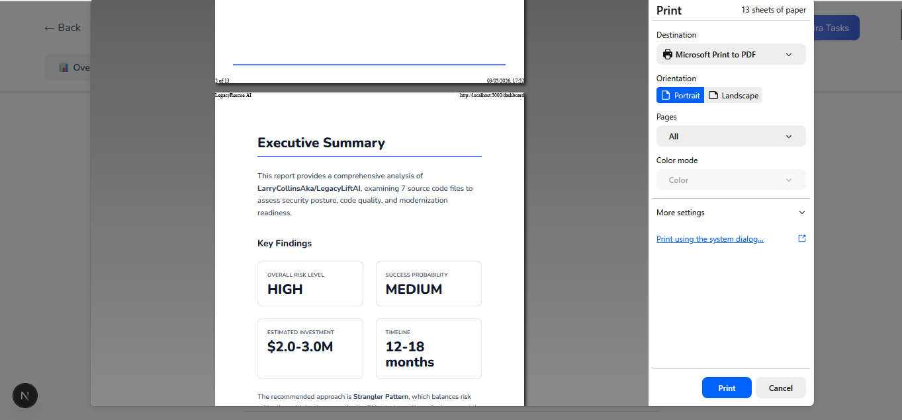
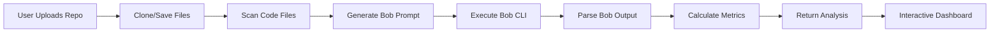

# 🚀 LegacyLiftAI

> **Turn Legacy Code Into Clear Intelligence**

An AI-powered legacy code modernization platform that transforms complex codebases into actionable business intelligence. Built with IBM Bob Orchestrator for the IBM Bob Dev Day Hackathon.

[](LICENSE)
[](https://nextjs.org/)
[](https://www.typescriptlang.org/)
[](https://ibm.com/bob)

---

## 📸 Screenshots

### 🏠 Homepage - Upload Your Codebase

*Analyze any GitHub repository or upload your local codebase with drag & drop support*

### 📊 Executive Dashboard - Risk Scorecard

*High-level metrics designed for C-level decision makers - not raw developer output*

### 💬 Live Bob Console - Interactive Analysis

*Ask Bob questions live: "Why is security low?" • "Show vulnerable files" • "Generate Jira tasks"*


### 📄 Executive Report - Board-Ready PDF

*Professional consulting-style report with security findings, roadmap, and strategic recommendations*

---

## ✨ Features

### 🎯 What Makes LegacyLiftAI Different

**Static Competitors:**
```
❌ Upload repo → Pretty PDF
❌ That's it
```

**LegacyLiftAI:**
```
✅ Upload repo
✅ See live analysis with Bob Orchestrator
✅ Ask follow-up questions interactively
✅ Explore vulnerable files with evidence
✅ Generate Jira tasks automatically
✅ Export board-ready executive reports
```

### 🔥 Core Features

#### 1️⃣ **Dual Input Methods**
- 📎 **GitHub URL** - Paste any public repo URL
- 📁 **File Upload** - Drag & drop your codebase (supports folders)

#### 2️⃣ **IBM Bob 3-Agent Analysis**
- 🤖 **Code Analyst** - Security vulnerabilities, complexity metrics, technical debt
- 📋 **Refactor Planner** - Timeline/budget estimates, migration approach, roadmap
- 📝 **Documentation Writer** - Architecture docs, success factors, risk identification

#### 3️⃣ **4-Layer Interactive Dashboard**

**Layer 1: Executive Overview**
- Risk Scorecard (CRITICAL/HIGH/MEDIUM/LOW)
- Security Score (0-100)
- Code Quality & Maintainability Metrics
- Investment Estimates & Timeline
- Success Probability

**Layer 2: Full Report**
- Professional consulting document
- Cover page with repository details
- Executive summary
- Detailed security analysis
- Code quality assessment
- Maintainability analysis
- Strategic roadmap (4 phases)
- Success factors & quick wins
- Print-optimized for PDF export

**Layer 3: Live Bob Console** 🔥
- Real-time chat with Bob
- Ask questions:
  - "Why is the security score low?"
  - "Show me vulnerable files"
  - "Explain the migration path"
  - "Generate Jira tasks"
- Smart contextual responses
- Suggested questions with 1-click

**Layer 4: Repository Explorer** 🔥
- Interactive file tree from actual cloned repo
- Vulnerable files marked with ⚠️
- Live code viewer
- Inline security warnings
- Recommended fixes displayed

#### 4️⃣ **Export & Integration**
- 📄 **PDF Export** - Executive-friendly formatted reports
- 💾 **JSON Export** - Structured analysis data
- 📋 **Jira Tasks** - Auto-generated CSV for import
- 🖨️ **Print-Ready** - Professional page breaks

---

## 🏗️ Tech Stack

- **Framework:** Next.js 16.2.4 (App Router)
- **Language:** TypeScript
- **AI Platform:** IBM Bob Orchestrator
- **Styling:** Tailwind CSS
- **File Processing:** Node.js fs/child_process
- **Git Integration:** Native git clone

---

## 🚀 Quick Start

### Prerequisites

- **Node.js** 18+ installed
- **IBM Bob CLI** installed ([Installation Guide](https://ibm.com/bob))
- **Bob API Key** ([Get your key](https://ibm.com/bob/api))
- **Git** installed (for GitHub URL analysis)

### Installation

1. **Clone the repository**
```bash
git clone https://github.com/yourusername/LegacyLiftAI.git
cd LegacyLiftAI
```

2. **Install dependencies**
```bash
npm install
```

3. **Configure environment variables**

Create `.env.local` in the project root:

```env
BOB_API_KEY=your_general_api_key_here
```

4. **Run the development server**
```bash
npm run dev
```

5. **Open your browser**
```
http://localhost:3000
```

---

## 📖 Usage Guide

### Analyzing a GitHub Repository

1. Navigate to the homepage
2. Click **"📎 GitHub URL"** tab
3. Paste a repository URL (e.g., `https://github.com/user/repo`)
4. Click **"Analyze Repo"**
5. Wait for Bob to analyze (typically 30s - 5min depending on size)
6. Explore the interactive dashboard!

### Uploading Local Files

1. Navigate to the homepage
2. Click **"📁 Upload Files"** tab
3. **Drag & drop** your codebase folder, or click to browse
4. Supported formats: `.js`, `.ts`, `.py`, `.java`, `.cpp`, `.c`, `.cs`, `.rb`, `.php`, `.go`, `.rs`
5. Click **"Analyze X Files"**
6. View your analysis!

### Using Bob Console

1. Click **"💬 Bob Console"** tab in the dashboard
2. Type your question or click a suggested question:
   - "Why is the security score low?"
   - "Show me vulnerable files"
   - "Explain the migration path"
   - "Generate Jira tasks"
3. Get instant intelligent responses from Bob
4. Continue the conversation with follow-ups

### Exploring Repository Files

1. Click **"📁 Repo Explorer"** tab
2. Browse your actual repository file tree
3. Files marked with ⚠️ contain vulnerabilities
4. Click any file to view its content
5. See inline security warnings and recommended fixes

### Exporting Results

**PDF Report:**
- Click **"📄 Export Executive PDF"** button
- Browser print dialog opens
- Save as PDF or print

**JSON Data:**
- Click **"💾 Export Data"** button
- Download structured JSON file
- Use for programmatic analysis

**Jira Tasks:**
- Click **"📋 Export Jira Tasks"** button
- Download CSV file
- Import directly into Jira

---

## 📂 Project Structure

```
LegacyLiftAI/
├── src/
│   ├── app/
│   │   ├── page.tsx                    # Homepage with upload/URL input
│   │   ├── dashboard/
│   │   │   └── page.tsx                # 4-layer interactive dashboard
│   │   └── api/
│   │       └── analyze/
│   │           └── route.ts            # Bob analysis API endpoint
│   ├── components/
│   │   └── AnalysisReport.tsx          # Professional PDF report component
│   └── styles/
│       └── globals.css                 # Tailwind configuration
├── public/
│   └── screenshots/                    # Screenshots for README
├── bob_sessions/                       # Bob IDE session exports (for judging)
│   ├── task-session-1.md
│   ├── task-session-2.md
│   └── screenshots/
├── .env.local                          # Environment variables (not committed)
├── .env.local.example                  # Environment template
├── package.json
├── tsconfig.json
└── README.md
```

---

## 🤖 How It Works

### Analysis Pipeline



### Bob Integration

LegacyLiftAI uses IBM Bob's Orchestrator mode with 3 specialized agents:

```bash
# Command executed
bob --non-interactive < prompt.txt

# Prompt structure
You are analyzing a legacy codebase: {repo_name}

Act as THREE specialized agents in ORCHESTRATOR mode:

**AGENT 1: Code Analyst**
- Analyze code quality and complexity
- Identify security vulnerabilities
- Find technical debt and code smells

**AGENT 2: Refactor Planner**
- Create prioritized modernization roadmap
- Estimate timeline and budget
- Recommend migration approach

**AGENT 3: Documentation Writer**
- Document current architecture
- Explain critical components
- Identify primary risks
```

### File Scanning

Supports 13 programming languages:
- JavaScript/TypeScript (`.js`, `.jsx`, `.ts`, `.tsx`)
- Python (`.py`)
- Java (`.java`)
- C/C++ (`.c`, `.cpp`)
- C# (`.cs`)
- Ruby (`.rb`)
- PHP (`.php`)
- Go (`.go`)
- Rust (`.rs`)

Automatically skips:
- `node_modules/`, `.git/`, `dist/`, `build/`, `target/`, `.next/`

---

## 🏆 Hackathon Submission

### IBM Bob Dev Day Hackathon Requirements

✅ **Theme:** "Turn idea into impact faster"  
✅ **Bob IDE Usage:** Analysis sessions exported to `/bob_sessions`  
✅ **Innovation:** Interactive dashboard beats static competitors  
✅ **Real-world Impact:** Executive decision support tool  

### Judging Criteria Alignment

| Criteria | How LegacyLiftAI Delivers |
|----------|---------------------------|
| **Innovation** | 4-layer interactive dashboard with live Bob chat + repo explorer |
| **Bob Integration** | 3-agent orchestrator analysis with real-time questioning |
| **User Experience** | Executive-friendly intelligence, not raw developer output |
| **Technical Excellence** | TypeScript, Next.js 16, real-time Git integration |
| **Business Value** | Turns months of analysis into minutes, actionable insights |

### Bob Session Exports

Located in `/bob_sessions/`:
- Task session consumption screenshots
- Exported markdown analysis files
- Session history and context

---

## 🎯 Target Users

### Primary: C-Level Executives & CTOs
- Need strategic modernization decisions
- Require budget/timeline estimates
- Want board-ready reports
- Limited technical background

### Secondary: Engineering Leaders
- Planning technical roadmaps
- Assessing acquisition targets
- Evaluating legacy system risks
- Building modernization business cases

### Tertiary: Project Managers
- Creating project plans
- Generating Jira tasks
- Tracking modernization metrics
- Reporting to stakeholders

---

## 🔒 Security & Privacy

- ✅ **No data persistence** - Analysis data stored in browser localStorage only
- ✅ **Temporary file handling** - Cloned repos deleted after analysis
- ✅ **API key security** - Keys stored in `.env.local`, never committed
- ✅ **No external tracking** - No analytics or third-party services
- ⚠️ **Public repo only** - GitHub cloning requires public access

---

## 🐛 Troubleshooting

### Bob CLI Not Found

**Error:** `bob: command not found`

**Solution:**
```bash
# Verify Bob is installed
bob --version

# If not installed, follow:
# https://ibm.com/bob/install

# Verify Bob is in PATH
which bob
```

### API Key Issues

**Error:** `⚠️ Bob not available, using simulated analysis`

**Solution:**
1. Check `.env.local` exists and contains `BOB_API_KEY`
2. Restart Next.js dev server after adding the key
3. Verify key is valid at https://ibm.com/bob/api

### Git Clone Failures

**Error:** `Repository cloning failed`

**Solution:**
- Verify repository URL is correct
- Ensure repository is public (private repos require auth)
- Check internet connection
- Try SSH URL if HTTPS fails: `git@github.com:user/repo.git`

### Large Repository Timeouts

**Error:** `Analysis timed out after 5 minutes`

**Solution:**
- Use file upload instead of GitHub URL for large repos
- Increase timeout in `src/app/api/analyze/route.ts`:
  ```typescript
  timeout: 600000, // 10 minutes
  ```

---

## 🚧 Roadmap

### Version 1.1 (Post-Hackathon)
- [ ] Real-time file content loading (not mocked)
- [ ] Persistent analysis history
- [ ] Multi-repository comparison
- [ ] Custom Bob prompts
- [ ] GitHub API integration (private repos)

### Version 2.0
- [ ] Team collaboration features
- [ ] Progress tracking dashboard
- [ ] Integration with project management tools
- [ ] Automated modernization suggestions
- [ ] Cost calculator with cloud pricing

---

## 📜 License

MIT License - see [LICENSE](LICENSE) file for details

---

## 👥 Team

**Project Lead:** [Your Name]  
**IBM Bob Integration:** [Your Name]  
**UI/UX Design:** [Your Name]  

Built for IBM Bob Dev Day Hackathon 2026

---

## 🙏 Acknowledgments

- **IBM Bob Team** - For the incredible AI orchestrator platform
- **Next.js Team** - For the amazing React framework
- **Tailwind CSS** - For beautiful, responsive styling
- **Hackathon Organizers** - For the opportunity to build something impactful

---

## 📞 Contact & Support

- **Issues:** [GitHub Issues](https://github.com/LarryCollinsAka/LegacyLiftAI/issues)
- **Email:** clatehlarry@gmail.com
- **Twitter:** [@yourhandle](https://twitter.com/yourhandle)
- **Demo Video:** [YouTube Link](https://youtube.com/...)

---

## 🌟 Star This Repo!

If LegacyLiftAI helped you modernize legacy code or win a hackathon, give it a ⭐!

---

<div align="center">

**Built with ❤️ using IBM Bob Orchestrator**

</div>